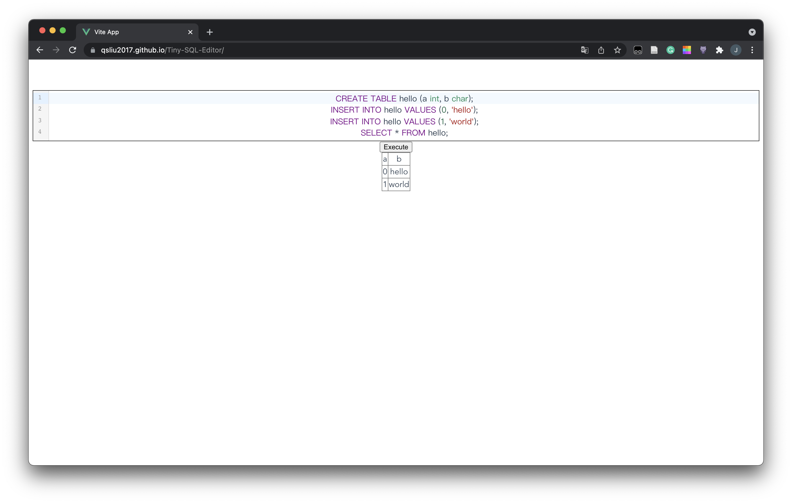

# Tiny-SQL-Editor

A tiny sql editor in browser. Avaliable on [Github Page](https://qsliu2017.github.io/Tiny-SQL-Editor).



A SQLite database is running on the web thanks to [sql.js](https://github.com/sql-js/sql.js). The sql editor uses [CodeMirror](https://codemirror.net/6/) library.

The struture of this editor is quit simple and extendable. The main part is just a Vue component `SqlEditor`:
```html
<script setup>
import SqlEditor from './components/SqlEditor.vue';
import BuildinSqliteExector from './lib/buildin-sqlite';
</script>

<template>
  <SqlEditor :sql-executor="BuildinSqliteExector" />
</template>
```

To support another sql database, whether on the browser or on the remote, you just need to implement an interface `ExecSql`, and inject it to `SqlEditor` by prop `sql-executor`.

```typescript
export interface SqlResult {
  columns: string[];
  values: string[][];
}

export interface ExecSql {
  (sql: string): ExecResult;
}

export type ExecResult = SqlResult[] | Error;
```